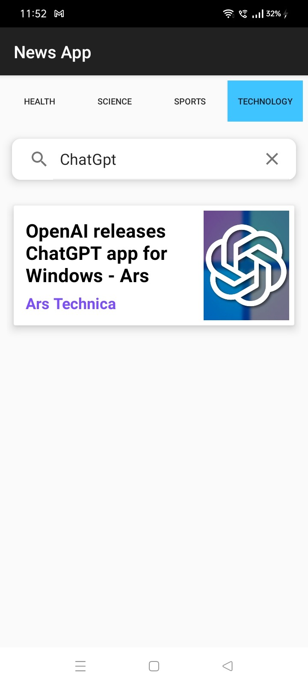

# 📰 NewsApp

NewsApp is an Android application that provides the latest news across various categories, including Business, Entertainment, General, Health, Science, Sports, and Technology. Users can easily browse news articles by topic or search for specific news using the built-in search functionality, making it a personalized news-reading experience. 📱

## ✨ Features
- 🌐 **Browse news articles by categories:**
  - 💼 Business
  - 🎭 Entertainment
  - 📰 General
  - 🏥 Health
  - 🔬 Science
  - ⚽ Sports
  - 💻 Technology
- 🔍 **Search for news articles** based on keywords.
- 🖼️ **Displays news headlines, descriptions, and images.**
- 🎨 **User-friendly interface** with smooth navigation.

## 📸 App Screenshots
<table>
  <tr>
    <td>
      
      <h3> 🌐 Browse News</h3>
    </td>
    <td>
      
      <h3> 🌐 Browse News</h3>
    </td>
  </tr>
  <tr>
    <td>
      
      <h3> 🔍 Search News</h3>
    </td>
    <td>
      
      <h3> 📰 Read News</h3>
    </td>
  </tr>
</table>

## Download Apk
https://drive.google.com/file/d/1yd0jduGI-Tr-SP308U8lN5TM4Z4SIsKk/view?usp=drive_link

## 🛠️ Technologies Used
- **📝 Java + XML**: Used for building the app's functionality and user interface.
- **📰 News API**: Provides the data source for the news articles.
- **📡 Retrofit**: A type-safe HTTP client used to make API requests and fetch news data.
- **🖼️ Picasso**: An image loading library used to load and display images from URLs.

## ⚙️ How It Works
1. The app fetches the latest news articles from the News API based on the selected category. 🗂️
2. Users can search for news articles using the search feature. 🔍
3. The data is retrieved using Retrofit and displayed in a RecyclerView. 📰
4. Images are loaded asynchronously using Picasso. 🖼️

## 🚀 Getting Started
1. Clone the repository:
   ```bash
   git clone https://github.com/your-username/NewsApp.git
